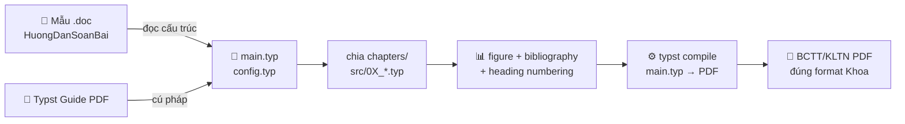

  

<h2 align="center">📚 HCMUS FETEL — Templates &amp; References cho KLTN/BCTT 📚</h2>

  
  
  
  

  

---

## Tổng quan / Overview

Repository tổng hợp **templates chính thức** và **tài liệu tham khảo** dùng cho:

- 📕 **Khóa luận tốt nghiệp (KLTN)** — Khoa Điện tử Viễn thông, HCMUS
- 📘 **Báo cáo Thực tập Thực tế (BCTT)** — Khoa Điện tử Viễn thông, HCMUS
- ✍️ **Typst Guide** — sách hướng dẫn chính thức Typst (PDF), dùng khi convert mẫu Word sang Typst
- 📊 **Reference XLSX** — bảng mã hàng và bảng data BTP, dùng để đối chiếu số liệu trong BCTT

Mục tiêu: cung cấp một **starter pack** cho sinh viên DTVT-HCMUS chuẩn bị tài liệu báo cáo theo đúng format Khoa, đặc biệt nếu chuyển sang stack hiện đại như **Typst** (LaTeX-killer, nhanh, sạch, có macro).

## Nội dung / Contents

### 📂 `HuongDanSoanBai/`

| File                                                                                       | Loại    | Mục đích                                                                                                |
| ------------------------------------------------------------------------------------------ | ------- | ------------------------------------------------------------------------------------------------------- |
| `Huong-dan-ve-khoa-luan-tot-nghiep_2022Mau-Bao-cao-KLTNUnicodeUpdate-8_2023.doc`            | `.doc`  | **Mẫu Khóa luận Tốt nghiệp** chính thức 2022/2023 — trang bìa, lời cảm ơn, mục lục, chương, tài liệu TK |
| `Mau-bao-cao-thuc-tap-thuc-te2022-Unicode-Mau-3.doc`                                       | `.doc`  | **Mẫu Báo cáo Thực tập Thực tế** chính thức 2022 — trang bìa, danh mục viết tắt, 7 chương               |
| `Typst Guide.pdf`                                                                          | `.pdf`  | **Sách hướng dẫn Typst chính thức** — set page, set text, function, show rule, figure, bibliography     |

### 📂 `XLSXThamKhao/`

| File                          | Loại     | Mục đích                                                                                       |
| ----------------------------- | -------- | ---------------------------------------------------------------------------------------------- |
| `BANG MÃ HH MOI 2025.xlsx`    | `.xlsx`  | Bảng **Mã Hàng Hóa BTP** mới nhất 2025 — đối chiếu nhóm sản phẩm trong BCTT (bếp từ, MRC, ...) |
| `DATA BTP.xlsx`               | `.xlsx`  | Bảng **Data BTP** — số liệu tham khảo cho phần giới thiệu công ty trong BCTT                   |

## Khi nào nên dùng / When to Use

<table>
  <tr>
    <td width="50%" valign="top">
      <h3>👨‍🎓 Sinh viên chuẩn bị BCTT/KLTN</h3>
      <ul>
        <li>Bắt đầu với <code>.doc</code> mẫu để xem cấu trúc Khoa yêu cầu</li>
        <li>Đọc <b>Typst Guide.pdf</b> để học cú pháp Typst (~30 phút)</li>
        <li>Tham khảo repo <a href="https://github.com/lhlizdabezt/BCTT-ThucTap-BTPHoldings">BCTT-ThucTap-BTPHoldings</a> để xem mẫu Typst đã convert sẵn</li>
        <li>Build PDF chỉ trong <code>typst compile main.typ</code> — không cần Word, không cần LaTeX cài nặng</li>
      </ul>
    </td>
    <td width="50%" valign="top">
      <h3>🔧 Sinh viên làm thực tập tại BTP Holdings</h3>
      <ul>
        <li><code>BANG MÃ HH MOI 2025.xlsx</code> giúp tra cứu mã sản phẩm (bếp đôi từ, máy rửa chén, ...)</li>
        <li><code>DATA BTP.xlsx</code> dùng để tham khảo cấu trúc công ty trong chương "Giới thiệu đơn vị thực tập"</li>
        <li>Trích dẫn các file này bằng IEEE format (xem <code>tai_lieu_tham_khao.bib</code> trong repo BCTT mẫu)</li>
      </ul>
    </td>
  </tr>
</table>

## Convert Word → Typst (workflow đề xuất)

## Liên quan / See also

- [`BCTT-ThucTap-BTPHoldings`](https://github.com/lhlizdabezt/BCTT-ThucTap-BTPHoldings) — BCTT đã convert sang Typst (mẫu thực tế)
- [`Slide-DoAnHTN-Nhom17-DE10Standard`](https://github.com/lhlizdabezt/Slide-DoAnHTN-Nhom17-DE10Standard) — Slide Typst 16:9 cho đồ án DTVT
- [`DoAnHeThongNhung`](https://github.com/lhlizdabezt/DoAnHeThongNhung) — Đồ án mẫu kèm báo cáo Typst

## License

- README, ghi chú hướng dẫn và workflow đề xuất: **MIT License** — xem [LICENSE](LICENSE).
- Các file `.doc` mẫu KLTN/BCTT: thuộc **bản quyền Khoa Điện tử Viễn thông — HCMUS**, được lưu lại để tham khảo nội bộ.
- `Typst Guide.pdf`: bản quyền **Typst maintainers** (Apache License 2.0 — xem [typst/typst](https://github.com/typst/typst)).
- `BANG MÃ HH MOI 2025.xlsx` và `DATA BTP.xlsx`: bản quyền **BTP Holdings** — chỉ dùng làm dữ liệu đối chiếu trong báo cáo thực tập.

  HCMUS · FETEL · K2022 CLC · Reproducible report stack with Typst

