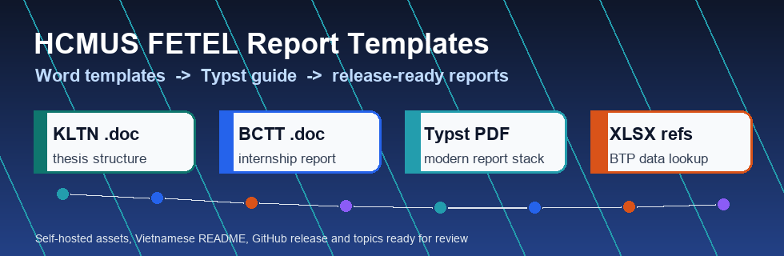
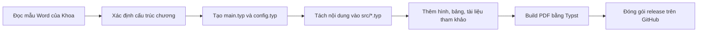

<p align="center">
  
</p>

<h1 align="center">📚 Bộ mẫu báo cáo KLTN, BCTT và tài liệu Typst cho sinh viên Điện tử Viễn thông HCMUS</h1>

<p align="center">
  <a href="https://github.com/lhlizdabezt/HCMUS-DTVT-BaoCao-Templates/releases/latest"></a>
  
  
  
</p>

<p align="center">
  
</p>

## Tóm tắt

Repository này là bộ tài liệu nền cho sinh viên **Khoa Điện tử - Viễn thông, Trường Đại học Khoa học Tự nhiên, ĐHQG-HCM** khi chuẩn bị **khóa luận tốt nghiệp**, **báo cáo thực tập thực tế** và bản báo cáo hiện đại bằng **Typst**.

Người duy trì repo là **Lương Hải Long - MSSV 22207056**, sinh viên ngành **Kỹ thuật Điện tử - Viễn thông**, khóa 2022 hệ Chất lượng cao. Mục tiêu của repo không phải thay thế quy định của Khoa, mà là gom các mẫu gốc, tài liệu hướng dẫn và file tham khảo vào một nơi có version, release, tag và mô tả rõ ràng để người đọc biết dùng file nào, dùng trong bối cảnh nào và liên hệ với repo báo cáo mẫu nào.

Repo này cũng liên kết trực tiếp với báo cáo thực tập tại BTP Holdings: [BCTT-ThucTap-BTPHoldings](https://github.com/lhlizdabezt/BCTT-ThucTap-BTPHoldings). Ở đó, các mẫu Word và tài liệu Typst trong repo này được chuyển thành một báo cáo Typst có 7 chương, ảnh minh chứng, bibliography và release PDF.

## Liên kết nhanh

| Mục | Liên kết | Ghi chú |
| --- | --- | --- |
| Repository | [HCMUS-DTVT-BaoCao-Templates](https://github.com/lhlizdabezt/HCMUS-DTVT-BaoCao-Templates) | Bộ mẫu báo cáo, Typst Guide và dữ liệu tham khảo |
| Release mới nhất | [GitHub Releases](https://github.com/lhlizdabezt/HCMUS-DTVT-BaoCao-Templates/releases/latest) | Bản đóng gói ổn định để tải nhanh |
| Tags | [Danh sách tag](https://github.com/lhlizdabezt/HCMUS-DTVT-BaoCao-Templates/tags) | Mốc phiên bản đã công bố |
| GitHub cá nhân | [lhlizdabezt](https://github.com/lhlizdabezt) | Portfolio kỹ thuật của Lương Hải Long |
| LinkedIn | [linkedin.com/in/lhlizdabezt](https://www.linkedin.com/in/lhlizdabezt) | Hồ sơ nghề nghiệp và học thuật |
| Báo cáo thực tập mẫu | [BCTT-ThucTap-BTPHoldings](https://github.com/lhlizdabezt/BCTT-ThucTap-BTPHoldings) | Ví dụ chuyển mẫu báo cáo sang Typst và đóng gói release PDF |

## Bộ tài liệu gồm gì

| Nhóm | File | Vai trò |
| --- | --- | --- |
| Mẫu khóa luận tốt nghiệp | `HuongDanSoanBai/Huong-dan-ve-khoa-luan-tot-nghiep_2022Mau-Bao-cao-KLTNUnicodeUpdate-8_2023.doc` | Mẫu Word cho KLTN: trang bìa, bố cục chương, mục lục, tài liệu tham khảo và quy cách trình bày |
| Mẫu báo cáo thực tập thực tế | `HuongDanSoanBai/Mau-bao-cao-thuc-tap-thuc-te2022-Unicode-Mau-3.doc` | Mẫu Word cho BCTT: phần mở đầu, 7 chương, phụ lục và yêu cầu hình thức |
| Tài liệu Typst | `HuongDanSoanBai/Typst Guide.pdf` | Tài liệu học cú pháp Typst, dùng khi chuyển báo cáo từ Word sang Typst |
| Bảng mã hàng tham khảo | `XLSXThamKhao/BANG_MA_HH_MOI_2025.xlsx` | Dữ liệu tham khảo cho nhóm sản phẩm BTP; tên file dùng ASCII để tránh lỗi đường dẫn |
| Dữ liệu BTP tham khảo | `XLSXThamKhao/DATA_BTP.xlsx` | Dữ liệu đối chiếu khi viết phần giới thiệu đơn vị thực tập |

## Giá trị cho HR và kỹ sư

| Tín hiệu đánh giá | Bằng chứng trong repo | Ý nghĩa khi xem portfolio |
| --- | --- | --- |
| Biết tổ chức tài liệu kỹ thuật | Có README, release, tag, topics, license, file gốc và file tham khảo tách thư mục | Không chỉ nộp file rời, mà biết biến tài liệu học thuật thành repo có thể review |
| Có tư duy tái sử dụng | Mẫu KLTN, mẫu BCTT, Typst Guide và repo BCTT mẫu được liên kết với nhau | Người khác có thể bắt đầu báo cáo mới từ cùng một bộ nền |
| Biết chuyển quy trình Word sang Typst | README mô tả luồng đọc mẫu Word, tách chương, viết `main.typ`, `config.typ`, build PDF | Thể hiện năng lực tài liệu hóa bằng công cụ hiện đại |
| Giữ ranh giới học thuật rõ ràng | Phân biệt phần MIT của README/hướng dẫn với tài liệu thuộc HCMUS, Typst và BTP Holdings | Trình bày có trách nhiệm, phù hợp môi trường học thuật và doanh nghiệp |
| Có liên kết portfolio thực tế | Trỏ sang `BCTT-ThucTap-BTPHoldings` để xem báo cáo đã đóng gói | HR và mentor kỹ thuật có thể kiểm tra kết quả ứng dụng thay vì chỉ đọc mô tả |

## Khi nào nên dùng

| Tình huống | Cách dùng repo |
| --- | --- |
| Chuẩn bị BCTT | Mở mẫu BCTT `.doc`, xem cấu trúc 7 chương, sau đó tham khảo repo BCTT Typst mẫu |
| Chuẩn bị KLTN | Mở mẫu KLTN `.doc`, giữ đúng cấu trúc Khoa yêu cầu rồi phát triển nội dung riêng |
| Muốn viết báo cáo bằng Typst | Đọc `Typst Guide.pdf`, sau đó tách báo cáo thành `main.typ`, `config.typ`, `src/*.typ` |
| Cần dữ liệu tham khảo về BTP | Dùng các file `.xlsx` trong `XLSXThamKhao/` để đối chiếu, không coi đây là dữ liệu công khai cho mục đích thương mại |
| Muốn xem bản đã triển khai | Mở repo [BCTT-ThucTap-BTPHoldings](https://github.com/lhlizdabezt/BCTT-ThucTap-BTPHoldings) để xem README, source Typst, ảnh và release PDF |

## Luồng làm báo cáo đề xuất



## Cây thư mục

```text
.
|-- HuongDanSoanBai/
|   |-- Huong-dan-ve-khoa-luan-tot-nghiep_2022Mau-Bao-cao-KLTNUnicodeUpdate-8_2023.doc
|   |-- Mau-bao-cao-thuc-tap-thuc-te2022-Unicode-Mau-3.doc
|   `-- Typst Guide.pdf
|-- XLSXThamKhao/
|   |-- BANG_MA_HH_MOI_2025.xlsx
|   `-- DATA_BTP.xlsx
|-- assets/
|   `-- hcmus-template-motion.gif
|-- docs/
|   `-- banner.svg
|-- README.md
|-- RELEASE_NOTES.md
|-- LICENSE
```

## Gợi ý chuyển từ Word sang Typst

1. Đọc mẫu Word để giữ đúng thứ tự trang bìa, lời cảm ơn, cam đoan, mục lục, danh sách hình, danh sách bảng, chương chính và phụ lục.
2. Tạo `config.typ` cho thông tin sinh viên, trường, khoa, giáo viên hướng dẫn, đơn vị thực tập và macro trình bày.
3. Tạo `main.typ` làm entry point, khai báo page, font, heading numbering, outline và bibliography.
4. Tách từng chương thành file riêng trong `src/` để dễ review bằng Git.
5. Đặt hình vào `assets/`, đặt tên file ASCII rõ nghĩa để tránh lỗi đường dẫn khi build trên Windows hoặc GitHub.
6. Build PDF, gắn tag, tạo release và ghi release notes để người khác biết bản nào là bản ổn định.

## Ranh giới sử dụng

| Thành phần | Ghi chú sử dụng |
| --- | --- |
| README, workflow, ghi chú tổ chức repo | Phát hành theo MIT License trong repo |
| Mẫu `.doc` của Khoa | Tài liệu tham khảo học thuật, thuộc HCMUS/FETEL; không sửa thành tài liệu thương mại |
| `Typst Guide.pdf` | Tài liệu của Typst maintainers; dùng để học cú pháp và đối chiếu khi viết báo cáo |
| File `.xlsx` BTP | Dữ liệu tham khảo cho bối cảnh BTP Holdings; không dùng lại cho mục đích thương mại |

## Repository liên quan

| Repo | Liên quan |
| --- | --- |
| [BCTT-ThucTap-BTPHoldings](https://github.com/lhlizdabezt/BCTT-ThucTap-BTPHoldings) | Báo cáo thực tập đã chuyển sang Typst, có 7 chương, ảnh minh chứng và release PDF |
| [lhlizdabezt](https://github.com/lhlizdabezt/lhlizdabezt) | Profile README tổng hợp portfolio kỹ thuật |
| [DoAnHeThongNhung](https://github.com/lhlizdabezt/DoAnHeThongNhung) | Đồ án Hệ thống nhúng với DE10-Standard SoC FPGA |
| [Slide-DoAnHTN-Nhom17-DE10Standard](https://github.com/lhlizdabezt/Slide-DoAnHTN-Nhom17-DE10Standard) | Slide Typst/Stargazer cho đồ án SoC FPGA |

<p align="center">
  <sub>Repo được tổ chức để tài liệu học thuật của HCMUS có thể được đọc, kiểm tra, version và đóng gói như một tài sản kỹ thuật.</sub>
</p>
