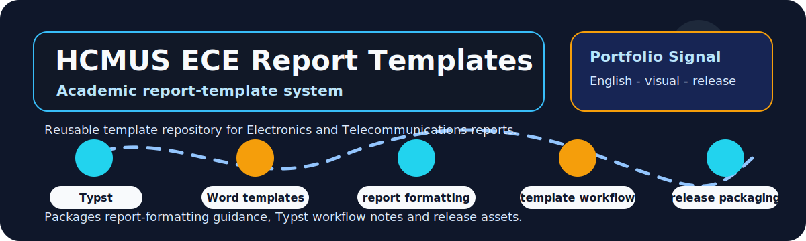

# HCMUS Electronics and Telecommunications Report Templates

  
  
  

  

## Overview

This repository packages reusable report templates and workflow notes for Electronics and Telecommunications academic reports at HCMUS.

| Field | Details |
|---|---|
| Repository | [HCMUS-DTVT-BaoCao-Templates](https://github.com/lhlizdabezt/HCMUS-DTVT-BaoCao-Templates) |
| Portfolio category | Documentation template and academic workflow repository |
| Primary stack | Typst, Word templates, report templates, academic writing, technical documentation, release assets. |
| Latest release | [GitHub Releases](https://github.com/lhlizdabezt/HCMUS-DTVT-BaoCao-Templates/releases/latest) |
| Tags | [Version tags](https://github.com/lhlizdabezt/HCMUS-DTVT-BaoCao-Templates/tags) |
| Owner profile | [Luong Hai Long](https://github.com/lhlizdabezt) |

## Reviewer Map

| What to Review | Where to Look | Why It Matters |
|---|---|---|
| Technical scope | This README and source tree | Gives a quick, bounded reading path before opening every file |
| Evidence assets | Release page and top-level project files | Shows what can be downloaded or inspected quickly |
| Implementation material | Source folders, scripts, notebooks or design files | Connects the portfolio claim to real project artifacts |
| Version history | Tags and release notes | Makes the repository easier to audit over time |

## Evidence Highlights

- Thesis and internship report template references.
- Typst Guide PDF and Word-to-Typst workflow notes.
- Reference spreadsheet and release assets.
- Reusable documentation system for consistent academic formatting.

## Repository Structure

| Path | Purpose |
|---|---|
| `assets/` | Top-level directory included in the repository |
| `docs/` | Top-level directory included in the repository |
| `HuongDanSoanBai/` | Top-level directory included in the repository |
| `XLSXThamKhao/` | Top-level directory included in the repository |
| `LICENSE` | Top-level file included in the repository |

## Scope and Boundaries

Template and documentation workflow repository. It supports academic formatting and report production, not a single engineering experiment.

## Role and Portfolio Context

Luong Hai Long maintains the template pack to standardize report-writing and release-backed documentation.

## Release and Tagging Notes

This repository is maintained as part of an English-facing engineering portfolio. Releases and tags are used to preserve reviewable snapshots of the project, including source state, documentation updates and any available visual or report assets.

## Writing Standard

The README follows an evidence-first style: direct technical nouns, clear project boundaries, release-backed artifacts and no inflated claims beyond what the repository can support.
