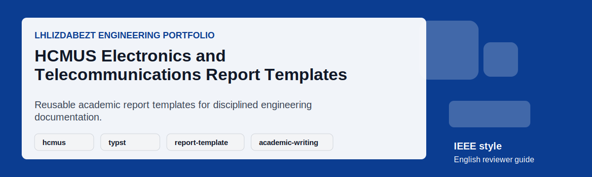

# HCMUS Electronics and Telecommunications Report Templates

## Executive Summary

This repository collects reusable report-template material for Electronics and Telecommunications coursework at VNUHCM University of Science. The public version focuses on clean English metadata, stable release packaging, and reviewer-friendly guidance for students who need consistent academic formatting.

## Project Snapshot

| Field | Details |
|---|---|
| Repository | [lhlizdabezt/HCMUS-DTVT-BaoCao-Templates](https://github.com/lhlizdabezt/HCMUS-DTVT-BaoCao-Templates) |
| Portfolio Track | Academic report templates, Typst assets, Word-format guidance, and reusable documentation patterns |
| Public Status | Reviewer-ready English guide with release-backed evidence |
| Latest Release | [Open stable release](https://github.com/lhlizdabezt/HCMUS-DTVT-BaoCao-Templates/releases/latest) |
| Owner Profile | [lhlizdabezt](https://github.com/lhlizdabezt) |
| Contact | 22207056@student.hcmus.edu.vn; luonghailong.work@gmail.com; Tel: +84988114708 |

## Reviewer Evidence Map

- Reusable template files for academic and technical reports.
- English instructions that help reviewers and students understand how to apply the templates.
- Release-backed visual assets for profile and repository previews.
- Professional formatting language aligned with engineering documentation expectations.

## Implementation Review Notes

| Review Point | What To Check |
|---|---|
| Problem framing | Confirm that the README explains the engineering purpose without exaggerated claims. |
| Technical evidence | Inspect the source folders, reports, scripts, schematics, or visual assets listed below. |
| Reproducibility | Use the local instructions where tools are available, or rely on the release snapshot for portfolio review. |
| Communication quality | Check headings, captions, tables, and release notes for clear English technical writing. |
| Professional boundary | Treat the repository as educational or portfolio evidence unless the source explicitly proves production deployment. |

## Repository Structure

| Path | Reviewer Purpose |
|---|---|
| `*.typ` | Typst templates, examples, or report sources. |
| `*.docx` | Word-format reference material when available. |
| `assets/` | Motion cards and visual preview assets. |
| `RELEASE_NOTES.md` | Release changelog for the English reviewer guide. |

## How To Review

- Review the README snapshot table to understand the template purpose.
- Open the Typst or Word reference files that match your target report format.
- Check the release notes for the current public-facing template polish pass.
- Use the latest release when you need a stable copy for coursework or portfolio review.

## How To Use Or Inspect Locally

- Choose the template closest to the assignment or seminar format.
- Replace student metadata, course title, supervisor information, and section content.
- Keep headings, captions, and tables in English when preparing public portfolio material.
- Compile Typst sources locally or use the Word-format references when required by the course.

## Visual Evidence

*Animated English reviewer card.*

## Release, Tags, And Topics

- Current release target: `reviewer-guide-2026-06-02`.
- Recommended topic set: `hcmus, typst, report-template, academic-writing, electronics, telecommunications, technical-writing, documentation, word-template, template`.
- Release notes are maintained in [`RELEASE_NOTES.md`](RELEASE_NOTES.md) for stable reviewer traceability.
- The release archive is intended for HR review, seminar evidence, and academic portfolio verification.

## Contact And Professional Links

| Channel | Link |
|---|---|
| GitHub | [https://github.com/lhlizdabezt](https://github.com/lhlizdabezt) |
| LinkedIn | [https://www.linkedin.com/in/lhlizdabezt](https://www.linkedin.com/in/lhlizdabezt) |
| Facebook | [https://www.facebook.com/wageseadrake](https://www.facebook.com/wageseadrake) |
| Instagram | [https://www.instagram.com/lhlizdabezt](https://www.instagram.com/lhlizdabezt) |
| YouTube | [https://www.youtube.com/@lhlizdabezt](https://www.youtube.com/@lhlizdabezt) |
| TikTok | [https://www.tiktok.com/@wageseadrake](https://www.tiktok.com/@wageseadrake) |
| Academic Email | [22207056@student.hcmus.edu.vn](mailto:22207056@student.hcmus.edu.vn) |
| Professional Email | [luonghailong.work@gmail.com](mailto:luonghailong.work@gmail.com) |
| Phone | [+84988114708](tel:+84988114708) |

## FAQ

| Question | Answer |
|---|---|
| Who is this for? | Students and reviewers who need a clear starting point for Electronics and Telecommunications reports. |
| Does it replace faculty instructions? | No. It supports formatting discipline and should be adjusted to the official assignment rules. |
| Why use releases? | Releases provide stable snapshots for review, reuse, and portfolio verification. |

## Scope And Boundaries

- This repository is presented as public engineering portfolio evidence.
- Claims are intentionally limited to what the repository, report, source files, simulations, or visual assets can support.
- Public text is written in English (United States) for HR, faculty, and engineering reviewers.
- SVG text is kept ASCII-safe to reduce rendering errors, mojibake, and missing-glyph blocks.
- Motion visuals avoid moving dotted paths, curved connector lines, and text-over-line compositions.

## Writing Standard

The public README, release notes, captions, and reviewer-facing metadata are written in a restrained IEEE and Harvard-inspired style: concise, evidence-first, technically accurate, and suitable for Electronics and Telecommunications portfolio review.
